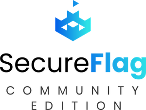

---

layout: col-sidebar
title: OWASP SecureFlag Community Edition
tags: training appsec secureflag
level: 1
type: platform
pitch: Training platform for developers to learn and practice modern secure coding techniques through hands-on exercises.

---

The SecureFlag Community Edition is an open source training platform created for developers to learn and practice modern secure coding techniques through hands-on exercises. The platform helps develop secure coding skills through real-world challenges to ensure knowledge acquired during the course can be confidently and continuously applied in the real world.

 

<iframe width="560" height="315" src="https://www.youtube.com/embed/24KrcgjsBaw" frameborder="0" allow="autoplay; encrypted-media" allowfullscreen></iframe>

 

Developers manually find, exploit and remediate the code of vulnerable applications running in disposable development environments accessed via a web browser. The platform offers 100% hands-on training, with no multiple-choice questions involved and uses an engine able to live-test code changes to measure efficacy, instantly displaying whether the code has been fixed and awarding points upon exercise completion.

## Functionalities

- Run exercises in a dedicated environment in the cloud; find & fix vulnerabilities following the instructions.
- Real, turn-key, development environment pre-configured with selected vulnerable exercises.
- Exercises focus on exploitation / remediation or secure coding and target the most common application security issues.
- Live-test changes to instantly learn if code has been fixed and award points for completing the exercise.
- Automated deployment on AWS through CloudFormation.
- Install Exercises from the SecureFlag Exercise Hub or create new ones with the SecureFlag SDK.
- Assign Learning Paths to align developer skills according to the company’s risk appetite.
- Setup Tournaments to engage the entire developer community in your organisation.
- Setup and manage Organisations, Teams and Users through the Management interface.
- Get Stats at an Organisational, Regional, Team and User level to quickly identify gaps.

### Discover more at [https://community.secureflag.com](https://community.secureflag.com).