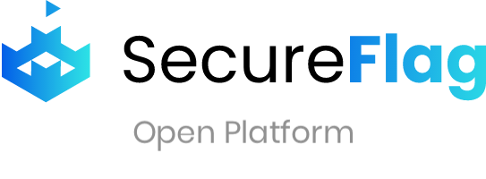

---

layout: col-sidebar
title: OWASP SecureFlag Open Platform
tags: training appsec securecoding secdevops secureflag
level: 2
type: tool
pitch: Training platform for developers to learn and practice modern secure coding techniques through hands-on exercises.

---

 

The SecureFlag Platform is a training platform created for developers to learn and practice modern secure coding techniques through hands-on exercises. The platform helps develop secure coding skills through real-world challenges to ensure knowledge acquired during the course can be confidently and continuously applied in the real world.

 
The SecureFlag Open Platform is an OWASP Project and includes an SDK and developer tools to create Labs for the SecureFlag platform.

 

<iframe width="560" height="315" src="https://www.youtube.com/embed/24KrcgjsBaw" frameborder="0" allow="autoplay; encrypted-media" allowfullscreen></iframe>

 

Developers manually find, exploit and remediate the code of vulnerable applications running in development environments accessed via a web browser. The platform offers 100% hands-on training, with no multiple-choice questions involved, and uses an engine able to live-test code changes to measure efficacy, instantly displaying whether the code has been fixed and awarding points upon exercise completion. 

SecureFlag provides a gamified experience where users can assemble into teams, track their progress through a leaderboard and unlock special challenges. Exercises are grouped into sequences of logically-linked units called Learning Paths that enable participants to attain expert, usable knowledge in relatively small steps. When candidates complete a Learning Path, they receive a SecureFlag certification; certifications have an expiration date and can be renewed by taking refresher exercises throughout the year. 

Armed with their newly embedded capacities, developers can take part in time-boxed tournaments and engage a whole community of participants from within the same organisation, all competing to remediate security issues.

Read more about exercise development in the [SDK](https://openplatform.secureflag.com/#/sdk/setup-sfsdk) section.

### Discover more at [https://openplatform.secureflag.com](https://openplatform.secureflag.com).
